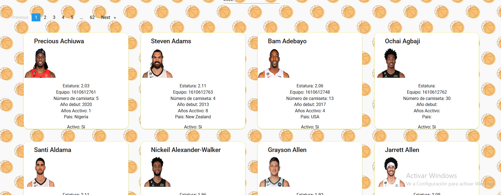
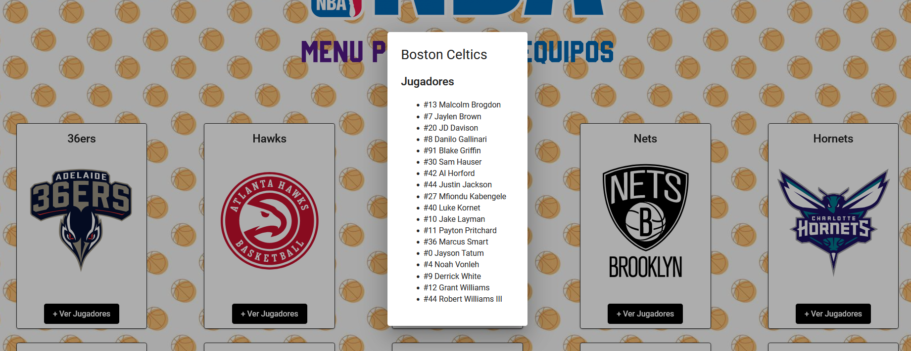
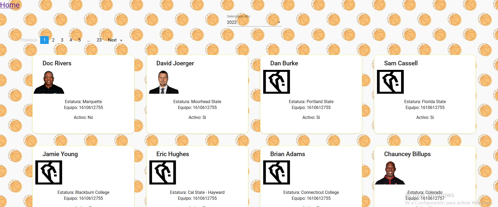

# Proyecto_NBAPI
Autores:  &nbsp;&nbsp;&nbsp;Ana Pilar Barba López (https://github.com/apbarba) &nbsp;&nbsp;&nbsp;Jerónimo Manuel Pérez González (https://github.com/jethrojonson)  
 
Proyecto en angular sobre la NBA que accedera a una API para mostrarnos información sobre los jugadores, equipos y entrenadores en los diferentes años en los que hay registros.

## Funcionalidades

### Mostrar Jugadores
Posibilidad de ver los jugadores de la NBA en cada año de los que han jugado y hay registro, para ello accedemos al endpoint correspondiete de la API (nba.data.net/data/10s/prod/v1/{{year}}/players.json)

### Mostrar Equipos
Posibilidad de ver los equipos por año, pudiendo incluso ver los jugadores de cada equipo mezclando el endpoint de jugadores y equipos (data.nba.net/data/10s/prod/v1/{{year}}/teams.json)

### Mostrar Entrenadores
Posibilidad de ver los entrenadores de cada año en el roast utilizando el endpoint (data.nba.net/data/10s/prod/v1/{{year}}/coaches.json)

